# Architecture Diagrams

This document provides visual representations of the Darts App architecture based on the current documentation.

## Global Architecture Overview

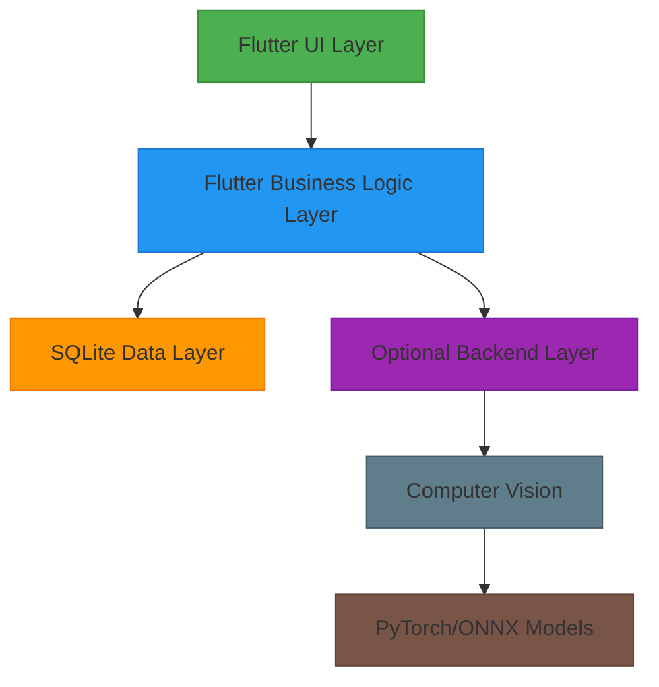

## Layered Architecture Diagram

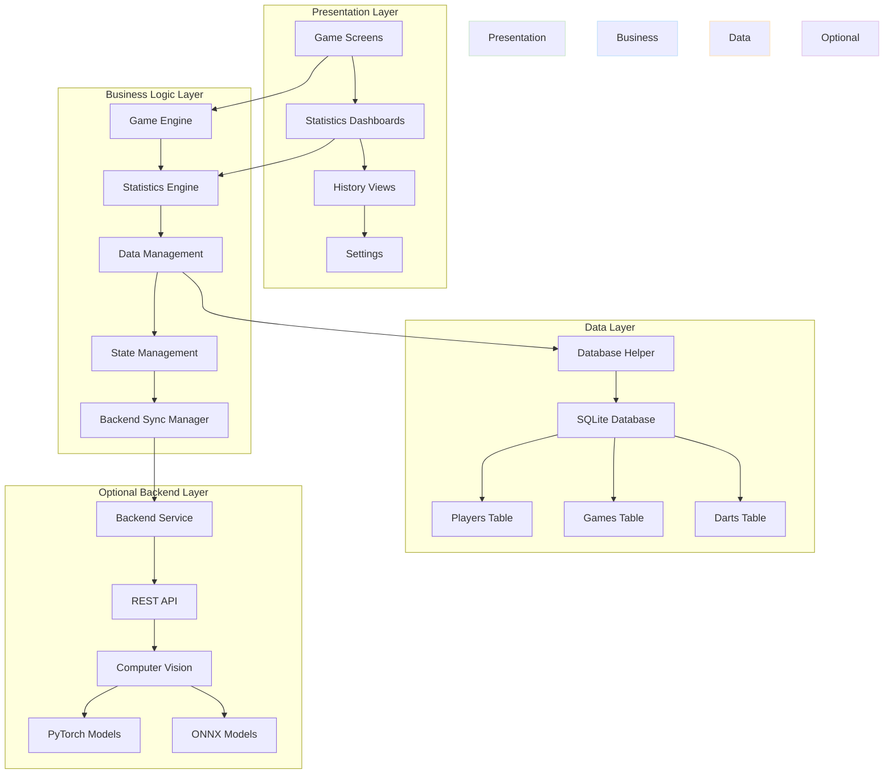

## Component Architecture

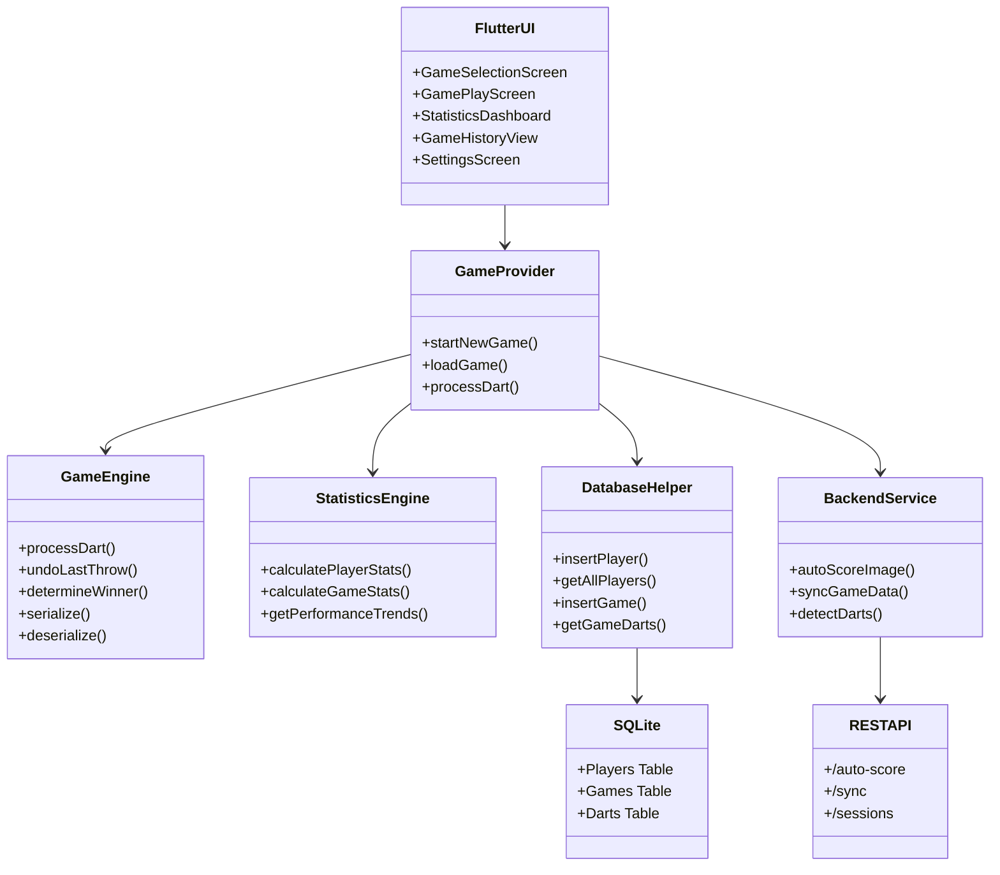

## Database Schema Diagram

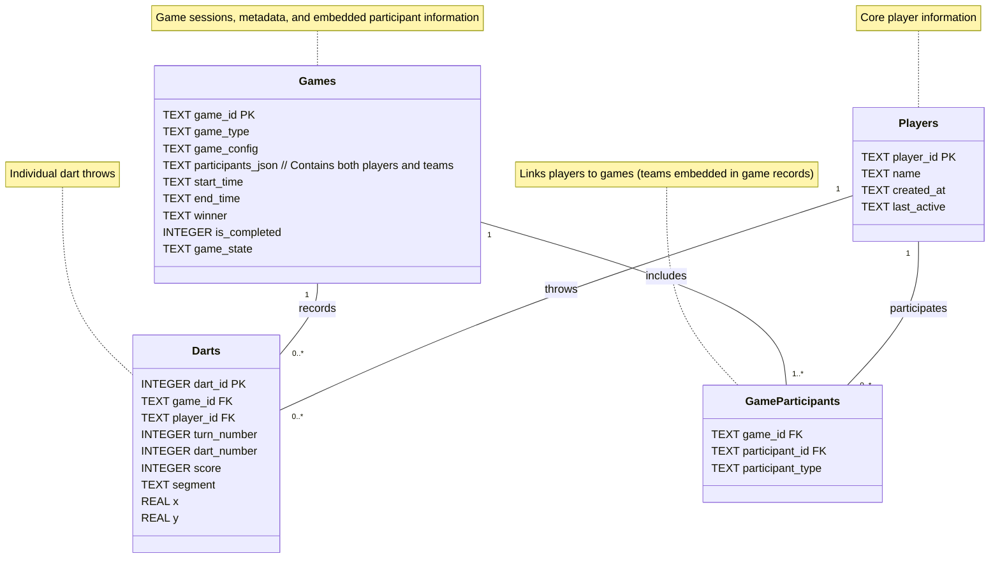

## Backend Integration Architecture

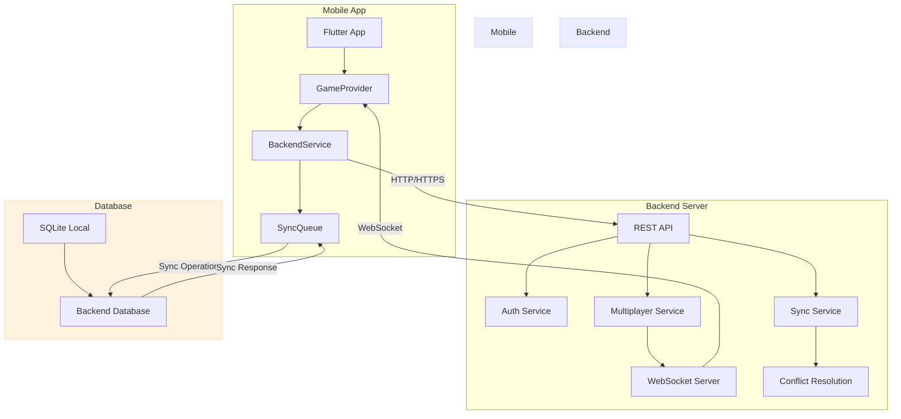

## Multiplayer Architecture

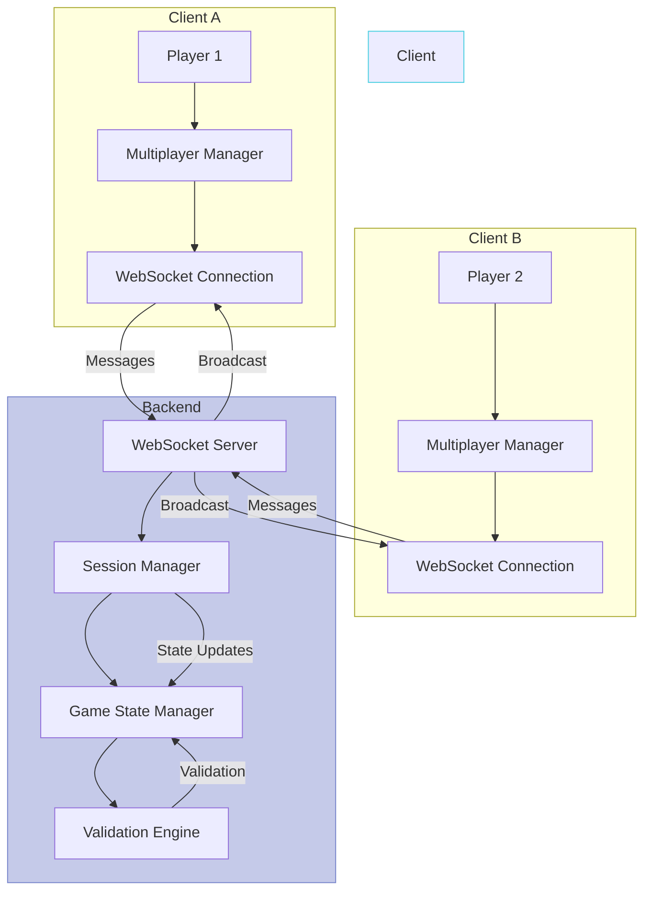

## Data Synchronization Flow

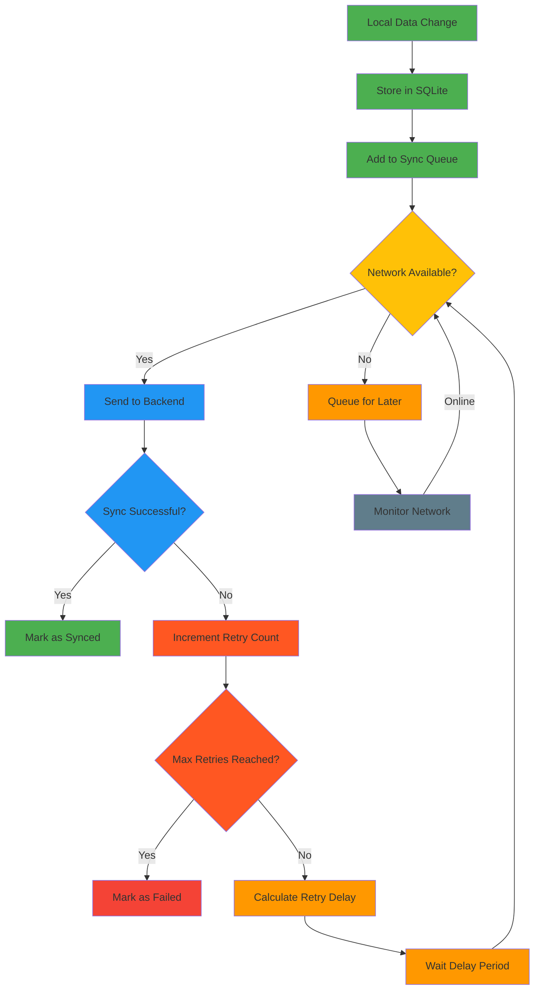

## Game Engine Class Diagram

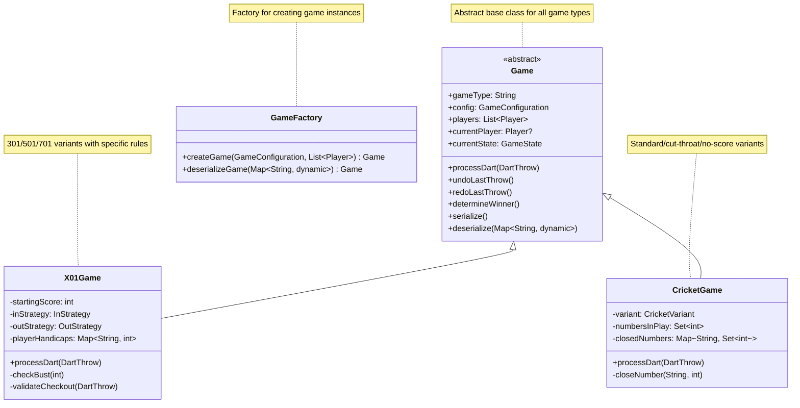

## State Management Architecture

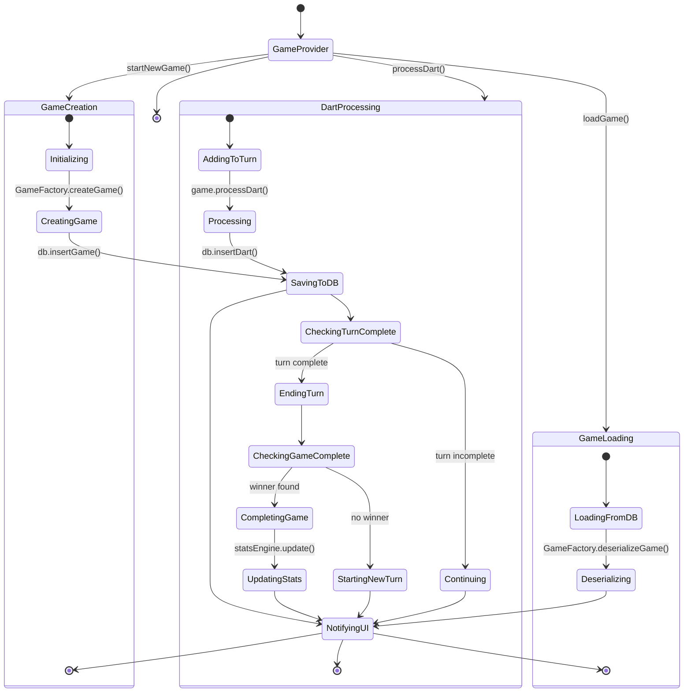

## Deployment Architecture

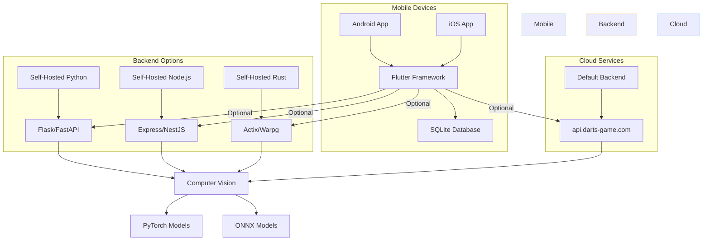

## Security Architecture

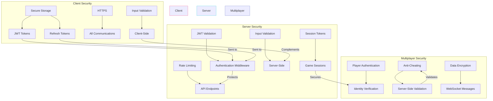

## Key Architectural Decisions Visualized

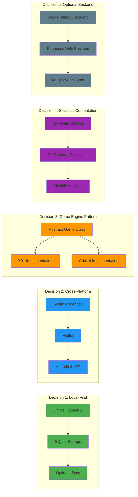

## Component Relationships

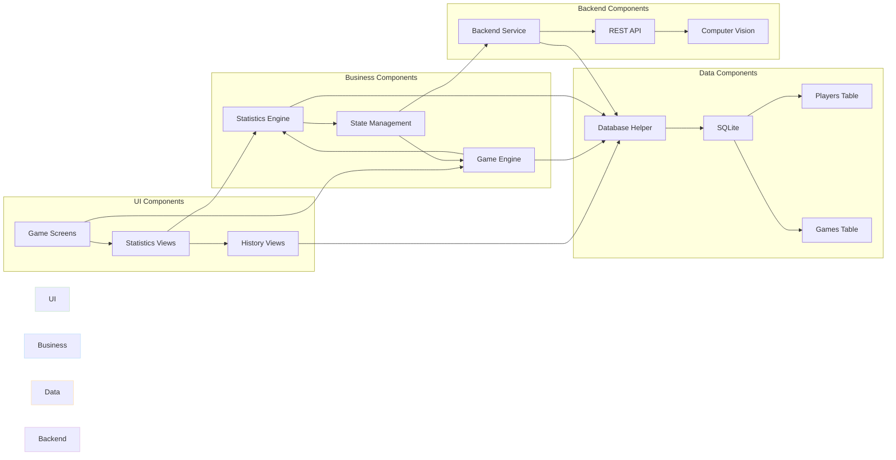

## Architecture Summary

These diagrams provide a comprehensive visual representation of the Darts App architecture:

- **Global Overview**: High-level architecture layers
- **Layered Architecture**: Detailed component breakdown
- **Component Architecture**: Class relationships and dependencies
- **Database Schema**: Entity-relationship diagram
- **Backend Integration**: Server-client communication
- **Multiplayer**: Real-time game sessions
- **Data Synchronization**: Offline-first sync workflow
- **Game Engine**: Class hierarchy and inheritance
- **State Management**: Complex state transitions
- **Deployment**: Various hosting options
- **Security**: Comprehensive security measures
- **Key Decisions**: Visualized architectural choices
- **Component Relationships**: System-wide dependencies

The diagrams use consistent color coding:
- **Green**: UI/Presentation layer
- **Blue**: Business logic layer  
- **Orange**: Data layer
- **Purple**: Backend services
- **Grey**: Infrastructure/Deployment
- **Pink/Red**: Security components