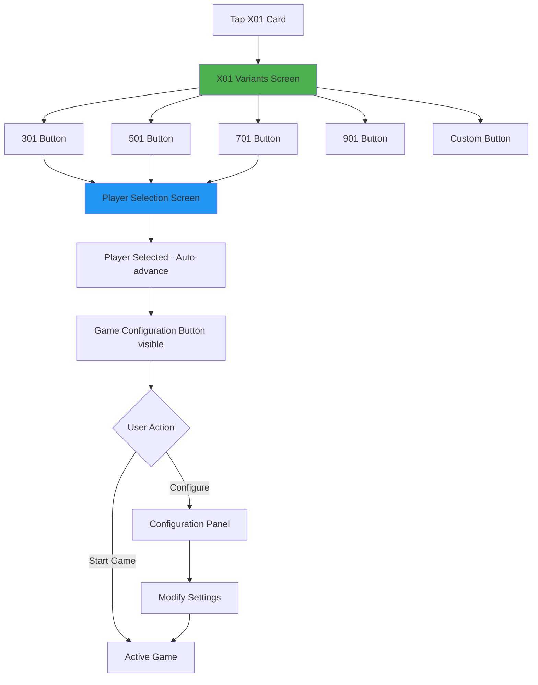
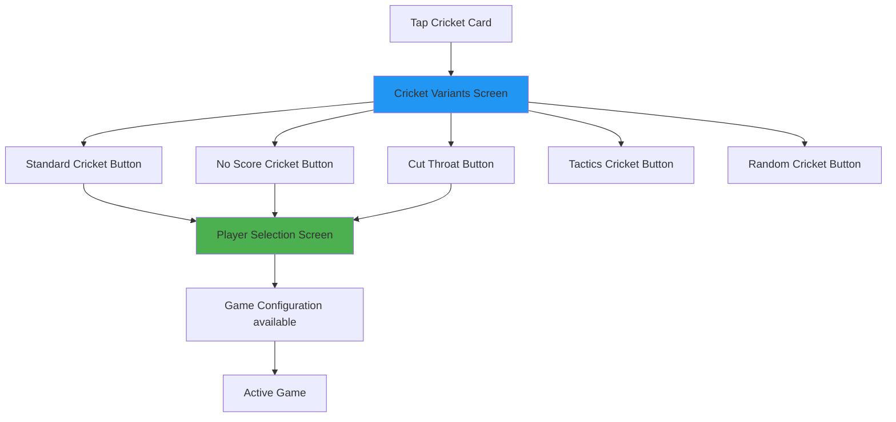
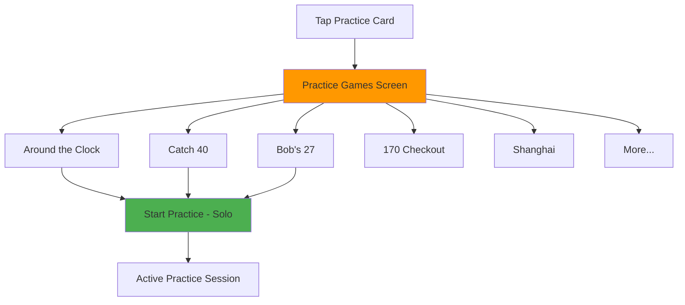

# UI Screen Flow Specifications (Dartsmind-Aligned)

**Status:** Authoritative  
**Scope:** User Interface Navigation and Interaction Flows  
**Version:** 3.0.0  
**Reference:** Dartsmind home screen and game selection pattern

---

## Core Navigation Philosophy

### Dartsmind's Key Innovation: Zero-Friction Game Start

**The Pattern:**
```
Home Screen → Game Type Card → Game Variant → Player Selection → Play
     (1 tap)        (1 tap)         (1 tap)           (Done)
```

**Total: 3 taps to start playing** (vs. typical apps requiring 5-7 taps)

---

## Home Screen (Dartsmind Pattern)

```mermaid
graph TD
    A[Home Screen - 2x2 Grid] --> B[X01 Card - Top Left]
    A --> C[Cricket Card - Top Right]
    A --> D[Practice Card - Bottom Left]
    A --> E[Stats Card - Bottom Right]
    A --> F[Game Lobby - Full Width]
    A --> G[More Features - Full Width]
    
    B --> B1[301]
    B --> B2[501]
    B --> B3[701]
    B --> B4[901]
    B --> B5[Custom]
    
    C --> C1[Standard Cricket]
    C --> C2[No Score Cricket]
    C --> C3[Cut Throat]
    C --> C4[Tactics Cricket]
    C --> C5[Random Cricket]
    
    D --> D1[Around the Clock]
    D --> D2[Catch 40]
    D --> D3[Bob's 27]
    D --> D4[170 Checkout]
    D --> D5[Shanghai]
    
    E --> E1[Statistics Dashboard]
    
    B1 --> H[Player Selection]
    C1 --> H
    D1 --> H
    
    H --> I[Game Starts]
    
    style A fill:#1A1A1A
    style B fill:#C62828
    style C fill:#00897B
    style D fill:#F57C00
    style E fill:#7B1FA2
```



### Home Screen Layout (Exact Dartsmind Pattern - 2x2 Grid)

```
┌─────────────────────────────────────┐
│  🎯 Darts                      ⋮    │ Header
│  Ready to play?                     │
├─────────────────────────────────────┤
│                                     │
│  ┌────────────┐  ┌────────────┐    │
│  │            │  │            │    │
│  │    X01     │  │  CRICKET   │    │ Row 1 (2x)
│  │   (501)    │  │            │    │
│  │            │  │            │    │
│  └────────────┘  └────────────┘    │
│                                     │
│  ┌────────────┐  ┌────────────┐    │
│  │            │  │            │    │
│  │  PRACTICE  │  │   STATS    │    │ Row 2 (2x)
│  │            │  │            │    │
│  │            │  │            │    │
│  └────────────┘  └────────────┘    │
│                                     │
│  ┌─────────────────────────────────┐│
│  │       GAME LOBBY               ││ Row 3 (Full)
│  └─────────────────────────────────┘│
│                                     │
│  ┌─────────────────────────────────┐│
│  │    VS. DARTS FRIENDS           ││ Row 4 (Full)
│  └─────────────────────────────────┘│
│                                     │
│  ┌─────────────────────────────────┐│
│  │    CONNECT VIA BLUETOOTH       ││ Row 5 (Full)
│  └─────────────────────────────────┘│
│                                     │
├─────────────────────────────────────┤
│ [Home] [History] [Stats] [Settings]│ Bottom Nav
└─────────────────────────────────────┘
```

**Key Design Elements (Matching Screenshot):**
- **2x2 Grid**: First 4 games in 2-column layout (X01, Cricket, Practice, Stats)
- **Square cards**: Equal width and height for grid items
- **Color-coded**: Each game type has distinct background color
  - X01: Red/burgundy
  - Cricket: Teal/cyan
  - Practice: Orange/amber
  - Stats: Purple/violet
- **Full-width rows**: Additional features below (Game Lobby, Friends, Bluetooth)
- **Icon + Text**: Centered within each card
- **No scrolling needed**: Top 4 actions immediately visible

---

## Game Selection Flow

### Flow 1: X01 Selection



### X01 Variants Screen

```
┌─────────────────────────────────────┐
│ ← Back        X01                   │
├─────────────────────────────────────┤
│                                     │
│  Select Starting Score              │
│                                     │
│  ┌─────────────────────────────────┐│
│  │            301                  ││ Round button
│  └─────────────────────────────────┘│
│                                     │
│  ┌─────────────────────────────────┐│
│  │            501                  ││ Round button
│  └─────────────────────────────────┘│ (Most common)
│                                     │
│  ┌─────────────────────────────────┐│
│  │            701                  ││ Round button
│  └─────────────────────────────────┘│
│                                     │
│  ┌─────────────────────────────────┐│
│  │            901                  ││ Round button
│  └─────────────────────────────────┘│
│                                     │
│  ┌─────────────────────────────────┐│
│  │         Custom Score            ││ Round button
│  │          [Enter: ___]           ││
│  └─────────────────────────────────┘│
│                                     │
└─────────────────────────────────────┘
```

**Design Notes:**
- **Vertical list**: Easy thumb navigation
- **Large buttons**: Minimum 56pt height
- **Clear spacing**: 16pt between buttons
- **Default highlight**: 501 slightly emphasized (most common)
- **Auto-scroll**: Ensures selected button is centered

### Flow 2: Cricket Selection



### Cricket Variants Screen

```
┌─────────────────────────────────────┐
│ ← Back       Cricket                │
├─────────────────────────────────────┤
│                                     │
│  Select Game Mode                   │
│                                     │
│  ┌─────────────────────────────────┐│
│  │      Standard Cricket           ││
│  │      15-20 + Bull               ││
│  └─────────────────────────────────┘│
│                                     │
│  ┌─────────────────────────────────┐│
│  │      No Score Cricket           ││
│  │      Close numbers only         ││
│  └─────────────────────────────────┘│
│                                     │
│  ┌─────────────────────────────────┐│
│  │       Cut Throat                ││
│  │      Score on opponents         ││
│  └─────────────────────────────────┘│
│                                     │
│  ┌─────────────────────────────────┐│
│  │      Tactics Cricket            ││
│  │      Strategic variant          ││
│  └─────────────────────────────────┘│
│                                     │
│  ┌─────────────────────────────────┐│
│  │      Random Cricket             ││
│  │      Random numbers each game   ││
│  └─────────────────────────────────┘│
│                                     │
└─────────────────────────────────────┘
```

**Design Notes:**
- **Brief description**: One-line explanation under each variant
- **Visual consistency**: Same button style as X01 variants
- **Most common first**: Standard Cricket at top

### Flow 3: Practice Selection



### Practice Games Screen

```
┌─────────────────────────────────────┐
│ ← Back       Practice               │
├─────────────────────────────────────┤
│                                     │
│  Choose Your Practice               │
│                                     │
│  ┌─────────────────────────────────┐│
│  │    Around the Clock             ││
│  │    Hit 1-20 in order            ││
│  │    Best: 42 darts ⭐            ││
│  └─────────────────────────────────┘│
│                                     │
│  ┌─────────────────────────────────┐│
│  │       Catch 40                  ││
│  │    Score 40+ in 3 darts         ││
│  │    Success: 68% 📈              ││
│  └─────────────────────────────────┘│
│                                     │
│  ┌─────────────────────────────────┐│
│  │       Bob's 27                  ││
│  │    Hit 1-20, D, T, then bull    ││
│  │    Best: 89 darts               ││
│  └─────────────────────────────────┘│
│                                     │
│  ┌─────────────────────────────────┐│
│  │     170 Checkout                ││
│  │    Practice max checkout        ││
│  │    Success: 12% 🎯              ││
│  └─────────────────────────────────┘│
│                                     │
│  ┌─────────────────────────────────┐│
│  │       Shanghai                  ││
│  │    Score big on each number     ││
│  └─────────────────────────────────┘│
│                                     │
└─────────────────────────────────────┘
```

**Design Notes:**
- **Personal stats**: Show user's best performance on each practice
- **Progress indicators**: Success rate, best score, trend
- **No player selection needed**: Practice is solo by default
- **Quick start**: Tap to begin immediately

---

## Player Selection Screen (Dartsmind Pattern)

### Layout - Exactly as Dartsmind

```
┌─────────────────────────────────────┐
│ ← Back    Players    [Game Config ▼]│ Config in top-right
├─────────────────────────────────────┤
│                                     │
│  Select Players (2 min)             │
│                                     │
│  ┌─────────────────────────────────┐│
│  │  👤 You              [✓]        ││ Auto-selected
│  └─────────────────────────────────┘│ (Current user)
│                                     │
│  Available Players:                 │
│                                     │
│  ┌─────────────────────────────────┐│
│  │  👤 Alice            [ ]        ││ Checkbox
│  └─────────────────────────────────┘│
│                                     │
│  ┌─────────────────────────────────┐│
│  │  👤 Bob              [ ]        ││ Checkbox
│  └─────────────────────────────────┘│
│                                     │
│  ┌─────────────────────────────────┐│
│  │  👤 Charlie          [ ]        ││ Checkbox
│  └─────────────────────────────────┘│
│                                     │
│  ┌─────────────────────────────────┐│
│  │  + Add New Player               ││
│  └─────────────────────────────────┘│
│                                     │
│         [START GAME]                │ Large button
│                                     │
└─────────────────────────────────────┘
```

**Key Features:**
1. **Current user auto-selected**: No need to search for yourself
2. **Config in top-right**: White rectangle button with dropdown icon
3. **Checkbox selection**: Multi-select other players
4. **Minimum 2 players**: For competitive games (practice = 1 player)
5. **Big start button**: Only appears when valid player count selected

### Game Configuration Panel (Dropdown from top-right)

```
┌─────────────────────────────────────┐
│ ┌─────────────────────────────────┐ │
│ │ Game Configuration          [×] │ │ Overlay panel
│ ├─────────────────────────────────┤ │
│ │                                 │ │
│ │ Starting Score: 501             │ │
│ │                                 │ │
│ │ In Strategy:                    │ │
│ │ ( ) Straight  (•) Double        │ │
│ │                                 │ │
│ │ Out Strategy:                   │ │
│ │ ( ) Straight  (•) Double        │ │
│ │                                 │ │
│ │ Legs to Win:                    │ │
│ │ [- 3 +]  (Best of 5)           │ │
│ │                                 │ │
│ │ Starting Player:                │ │
│ │ [Random ▼]                      │ │
│ │                                 │ │
│ │ ☐ Advanced Settings             │ │
│ │                                 │ │
│ │        [Apply]                  │ │
│ └─────────────────────────────────┘ │
└─────────────────────────────────────┘
```

**Design Notes:**
- **Overlay**: Panel slides down from top-right
- **Smart defaults**: Most common settings pre-selected (Double Out, etc.)
- **Quick access**: Available before AND during game
- **Optional**: Users can play with defaults without ever opening this

---

## Complete User Flow Comparison

### Dartsmind Pattern (Our New Design)

```
Home Screen
    ↓ (1 tap)
X01 Card
    ↓ (1 tap)
"501" Button
    ↓ (auto-navigate)
Player Selection
    ↓ (current user auto-selected)
Tap opponent checkboxes
    ↓ (optional: tap config in top-right)
[START GAME]
    ↓
Play

Total: 3 mandatory taps
Optional: +1 tap for config
```

### Old Complex Pattern (Avoided)

```
Home Screen
    ↓
"New Game" Button
    ↓
Game Type Selection Screen
    ↓
"X01" Card
    ↓
Configuration Screen (Step 1/4)
    ↓
Select 501
    ↓
Next Button (Step 2/4)
    ↓
Configure Rules
    ↓
Next Button (Step 3/4)
    ↓
Select Players
    ↓
Next Button (Step 4/4)
    ↓
Review Screen
    ↓
[START GAME]

Total: 7+ taps required
```

---

## Active Game Screen (Dartsmind Layout)

### Key Observations from Screenshots

**Common Elements Across All Game Types:**
1. **Header Bar** - Menu (⋮), game type/mode, info (i), round/leg info
2. **Dart Indicators** - 3 dart icons showing thrown darts
3. **Score Display** - Large, prominent in dark section
4. **Player Info** - Name, current status on left side
5. **Performance Metric** - PPR/MPR/Hit Rate below score
6. **Input Grid** - Number layout specific to game type
7. **Bottom Actions** - Undo arrow on left, "NEXT ROUND" button (orange)

**Layout Pattern:**
- Dark top section (score + player)
- Light grid section (input)
- Bottom action bar

---

### X01 Game Screen (Image 1)

```
┌─────────────────────────────────────┐
│ ⋮  🎯  501  (i)  :R1/20, LEG1       │ Header
├─────────────────────────────────────┤
│   ────🎯  ────🎯  ────🎯            │ Dart indicators
├─────────────────────────────────────┤
│ ┌───────────────────────────────────┤
│ │ 501 [0]                      501  │ Player + Score
│ │ MATHRB                            │ (Dark section)
│ │                                   │
│ │         PPR: 0.0                  │ Performance
│ └───────────────────────────────────┤
│                                     │
│ ┌──────┬───────┬───────┐           │ Top row special
│ │ MISS │ BULL  │ BULL  │           │
│ │      │ (25)  │ (50)  │           │
│ └──────┴───────┴───────┘           │
│                                     │
│ ┌────────────────────────────────┐ │
│ │ 20  19  18  17  16  15  14  13 │ │ Grid rows
│ │ 12  11  10   9   8   7   6   5 │ │ Numbers only
│ │  4   3   2   1                 │ │ No visible
│ └────────────────────────────────┘ │ multipliers
│                                     │
│ ┌────────────────────────────────┐ │
│ │ 20  19  18  17  16  15  14  13 │ │ Row 2: Double
│ │ ..  ..  ..  ..  ..  ..  ..  .. │ │ (2 dots)
│ │ 12  11  10   9   8   7   6   5 │ │
│ │ ..  ..  ..  ..  ..  ..  ..  .. │ │
│ │  4   3   2   1                 │ │
│ │ ..  ..  ..  ..                 │ │
│ └────────────────────────────────┘ │
│                                     │
│ ┌────────────────────────────────┐ │
│ │ 20  19  18  17  16  15  14  13 │ │ Row 3: Triple
│ │ ... ... ... ... ... ... ... ...│ │ (3 dots)
│ │ 12  11  10   9   8   7   6   5 │ │
│ │ ... ... ... ... ... ... ... ...│ │
│ │  4   3   2   1                 │ │
│ │ ... ... ... ...                │ │
│ └────────────────────────────────┘ │
│                                     │
│ ↶                                   │ Undo arrow
│                                     │
│ ┌───────────────────────────────┐  │
│ │      NEXT ROUND               │  │ Orange button
│ └───────────────────────────────┘  │
└─────────────────────────────────────┘
```

**X01 Key Features:**
- **Grid Layout**: 4 separate rows (Single, Double, Triple, + top row)
- **Top Row**: MISS | BULL(25) | BULL(50)
- **Number Rows**: 20-13, 12-5, 4-1 (dartboard order)
- **Dot Notation**: 
  - Row 1: No dots (single)
  - Row 2: Two dots (..) below numbers (double)
  - Row 3: Three dots (...) below numbers (triple)
- **No Visible Grid Lines**: Clean, minimal design
- **Score Prominent**: Large score in center of dark section
- **Player Left**: Name and legs on left side

---

### Cricket Game Screen (Image 2)

```
┌─────────────────────────────────────┐
│ ⋮  🎯  CRICKET  (i)  :R1/20, LEG1   │ Header
├─────────────────────────────────────┤
│   ────🎯  ────🎯  ────🎯            │ Dart indicators
├─────────────────────────────────────┤
│ ┌─────────┬───────────────────────┐ │
│ │ MATHRB  │                       │ │ Split layout:
│ │    0    │      MISS       ↶     │ │ Score | Controls
│ │ MPR: 0.0│                       │ │
│ └─────────┴───────────────────────┘ │
│                                     │
│                                     │
│ ┌───┬───┬───┐                      │ 3-column input
│ │20 │20 │20 │                      │ Single/Dbl/Tpl
│ │   │.. │...│                      │
│ ├───┼───┼───┤                      │
│ │19 │19 │19 │                      │
│ │   │.. │...│                      │
│ ├───┼───┼───┤                      │
│ │18 │18 │18 │                      │
│ │   │.. │...│                      │
│ ├───┼───┼───┤                      │
│ │17 │17 │17 │                      │
│ │   │.. │...│                      │
│ ├───┼───┼───┤                      │
│ │16 │16 │16 │                      │
│ │   │.. │...│                      │
│ ├───┼───┼───┤                      │
│ │15 │15 │15 │                      │
│ │   │.. │...│                      │
│ ├───┼───┼───┤                      │
│ │BULL│BULL │                       │
│ │   │ ..  │                       │
│ └───┴────┴───┘                     │
│                                     │
│ ┌───────────────────────────────┐  │
│ │      NEXT ROUND               │  │ Orange button
│ └───────────────────────────────┘  │
└─────────────────────────────────────┘
```

**Cricket Key Features:**
- **3-Column Grid**: Number | Double | Triple for each number
- **Vertical Layout**: 20, 19, 18, 17, 16, 15, BULL
- **Split Top Section**: Score (left) | Controls (right)
- **MISS Button**: Top right with undo arrow
- **Narrower Columns**: Only 3 columns instead of full grid
- **Clear Separation**: Dark bars between rows
- **Left Aligned**: Grid starts from left edge

---

### Around the Clock (Practice Mode - Image 3)

```
┌─────────────────────────────────────┐
│ ⋮  🎯  A.T. CLOCK (i) :R1/100, LEG1 │ Header
├─────────────────────────────────────┤
│   ────🎯  ────🎯  ────🎯            │ Dart indicators
├─────────────────────────────────────┤
│ ┌───────────────────────────────────┤
│ │ MATHRB                            │
│ │                                   │
│ │           1                       │ Large target
│ │                                   │ number
│ │     HIT RATE: 0%                  │
│ └───────────────────────────────────┤
│ NEXT:                                │ Next target
│   2                                  │ (grayed)
│                                      │
│      ┌─────────────┐                │ Visual dartboard
│      │  Dartboard  │                │ Current target
│      │    Visual   │                │ highlighted
│      │   Target:1  │                │ (orange)
│      └─────────────┘                │
│                                      │
│ ┌──────┬──────┬──────┐              │ 3-column input
│ │ S-1  │ D-1  │ T-1  │              │ Only current
│ │      │      │      │              │ target number
│ └──────┴──────┴──────┘              │
│                                      │
│                          ↶           │
│ ┌──────┬────────────────────┐       │
│ │ MISS │   NEXT ROUND       │       │ Split bottom
│ └──────┴────────────────────┘       │
└─────────────────────────────────────┘
```

**Around the Clock Key Features:**
- **Large Target Display**: Current number prominently shown
- **Visual Dartboard**: Shows current target highlighted
- **Next Preview**: Shows upcoming target (grayed out)
- **Simple Input**: Only 3 buttons (S-X, D-X, T-X) for current target
- **Hit Rate**: Success percentage tracking
- **Practice Stats**: Different metric than competitive games
- **Split Bottom**: MISS on left, NEXT ROUND on right

---

### Common Design Patterns

**Header (All Games):**
```
┌─────────────────────────────────────┐
│ [⋮] [Icon] [GameName] [(i)] [Round] │
│                                     │
│   Status: R1/20, LEG1               │
└─────────────────────────────────────┘

Elements:
- Menu button (⋮) - left
- Game icon 🎯
- Game name
- Info button (i)
- Round/Leg counter - right
```

**Dart Indicators:**
```
────🎯  ────🎯  ────🎯

States:
- Empty dart: ──── (gray line)
- Thrown dart: ────🎯 (line + dart icon)
```

**Score Section Layouts:**

*X01 Full Width:*
```
┌───────────────────────────────┐
│ Score [Legs]          BigNum  │
│ PlayerName                    │
│         PPR: X.X              │
└───────────────────────────────┘
```

*Cricket Split:*
```
┌──────────┬────────────────────┐
│ Player   │                    │
│   Score  │   MISS      ↶      │
│ MPR: X.X │                    │
└──────────┴────────────────────┘
```

*Practice Full Width:*
```
┌───────────────────────────────┐
│ PlayerName                    │
│                               │
│        Target: 1              │
│                               │
│    HIT RATE: 0%               │
└───────────────────────────────┘
```

**Bottom Action Bar:**
```
┌─────────────────────────────────────┐
│  ↶                                  │ Undo arrow (left)
│                                     │
│ ┌───────────────────────────────┐  │
│ │      NEXT ROUND               │  │ Orange button
│ └───────────────────────────────┘  │
└─────────────────────────────────────┘

Variations:
- Sometimes MISS button included (left bottom)
- Undo arrow always present
- NEXT ROUND always orange, full width or right side
```

---

### Input Grid Specifications by Game Type

**X01 - Horizontal Rows:**
```dart
Layout:
- Row 0: [MISS] [BULL 25] [BULL 50]
- Row 1: 20-13 (single)
- Row 2: 20-13, 12-5, 4-1 (double, 2 dots)
- Row 3: 20-13, 12-5, 4-1 (triple, 3 dots)

Button Size:
- Height: 80pt per row
- Width: Dynamic based on screen / column count
- 10 columns for 20-13, 8 columns for 12-5, 4 columns for 4-1

Visual:
- No grid lines between cells
- Number above, dots below
- Light background (cream/beige)
- Selected cell: Orange highlight
```

**Cricket - Vertical Columns:**
```dart
Layout:
- 3 columns: Single | Double | Triple
- 7 rows: 20, 19, 18, 17, 16, 15, BULL
- Each cell: Number + dots below

Button Size:
- Width: Screen width / 3
- Height: 100pt per row
- Total: 7 rows = 700pt

Visual:
- Dark gray bars between rows
- Light background within rows
- Column 1: No dots
- Column 2: Two dots (..)
- Column 3: Three dots (...)
```

**Practice - Simple 3-Button:**
```dart
Layout:
- Only 3 buttons showing current target
- [S-X] [D-X] [T-X]
- Changes dynamically as target advances

Button Size:
- Width: Screen width / 3
- Height: 140pt
- Large, easy to tap

Visual:
- Clean, minimal
- Current target number in button
- S/D/T prefix clear
```

---

### Color Scheme

**Dark Section (Score Area):**
- Background: #2C2C2C (dark gray)
- Text: #FFFFFF (white)
- Accent: #FF9800 (orange for highlights)

**Light Section (Input Grid):**
- Background: #F5E6D3 (cream/beige)
- Grid cells: #FAFAFA (off-white)
- Selected: #FFB74D (orange)
- Dots: #9E9E9E (medium gray)

**Bottom Bar:**
- Background: #424242 (dark gray)
- NEXT ROUND button: #FF9800 (orange)
- Button text: #FFFFFF (white)
- Undo arrow: #BDBDBD (light gray)

---

### Typography

**Score Display:**
- Font: Bold, sans-serif
- Size: 120pt (X01), 80pt (Cricket), 100pt (Practice)
- Weight: 700
- Color: White

**Player Name:**
- Font: Bold, sans-serif
- Size: 24pt
- Weight: 600
- Color: White

**Grid Numbers:**
- Font: Bold, sans-serif
- Size: 32pt
- Weight: 700
- Color: #2C2C2C (dark)

**Dots (Multipliers):**
- Font: Bold
- Size: 20pt
- Color: #9E9E9E
- Position: Below number, centered

**Stats (PPR/MPR):**
- Font: Regular, sans-serif
- Size: 18pt
- Weight: 400
- Color: White

---

### Interaction States

**Button States:**
```
Normal:
- Background: #FAFAFA
- Border: None
- Shadow: None

Pressed:
- Background: #FFB74D (orange)
- Border: 2px solid #F57C00
- Immediate visual feedback

Disabled:
- Background: #E0E0E0
- Text: #9E9E9E
- No interaction
```

**NEXT ROUND Button:**
```
Normal:
- Background: #FF9800
- Text: White, 20pt bold
- Height: 80pt
- Border radius: 0 (sharp corners)

Pressed:
- Background: #F57C00 (darker orange)
- Slight scale down (0.98)

Disabled (turn not complete):
- Background: #FFE0B2 (light orange)
- Text: #9E9E9E
```

---

### Animation & Feedback

**Dart Input:**
1. User taps cell
2. Cell background → orange (instant)
3. Haptic feedback (light tap)
4. Dart indicator updates
5. Score recalculates (if applicable)
6. Cell returns to normal color

**Next Round:**
1. Tap NEXT ROUND
2. Button animates (scale down)
3. Score section slides up slightly
4. New round info fades in
5. Grid resets to normal state
6. Dart indicators clear
7. Next player highlighted

**Visual Dartboard (Practice):**
1. Target segment pulses gently
2. Orange highlight on current number
3. When hit: Green flash animation
4. Progress tracker updates
5. Next number highlights

---

### Responsive Considerations

**Small Screens (< 375pt width):**
- Reduce grid cell height slightly (70pt for X01)
- Maintain minimum 44x44pt touch targets
- Stack some elements if needed
- Ensure 3-dart indicators visible

**Large Screens (> 428pt width):**
- Center grid with max width (600pt)
- Use extra space for margins
- Don't stretch buttons beyond comfortable reach
- Consider showing more stats in side panels

**Landscape Mode:**
- Rotate to split view: Score left | Grid right
- Maintain all functionality
- Adjust proportions (40% score, 60% grid)
- Keep bottom bar full width

---

### Summary of Key Differences from Previous Design

| Aspect | Old Design | Dartsmind Actual | Change Reason |
|--------|-----------|------------------|---------------|
| X01 Grid | All numbers in one view | Separated rows (S/D/T) | Clearer multiplier selection |
| Cricket Grid | Horizontal rows | Vertical columns (3-col) | Better fits cricket numbers |
| Dot Position | Inside cell | Below number | Cleaner visual, easier to read |
| Score Display | Top bar only | Integrated dark section | More prominent, better hierarchy |
| Input Method | Cycle through dots | Select row directly | Faster, one tap instead of 1-3 |
| Bottom Button | Multiple buttons | Single NEXT ROUND + undo | Simpler, clearer action |
| Practice Mode | Same as games | Unique dartboard visual | Better for skill tracking |

---

### Implementation Notes

**X01 Grid Component:**
```dart
class X01InputGrid extends StatelessWidget {
  Widget build(BuildContext context) {
    return Column(
      children: [
        // Row 0: Special buttons
        Row(children: [
          GridButton(label: 'MISS', multiplier: 0),
          GridButton(label: 'BULL', value: 25),
          GridButton(label: 'BULL', value: 50),
        ]),
        
        // Row 1: Singles (20-1)
        Row(children: numbers.map((n) => 
          GridButton(label: '$n', multiplier: 1)
        )),
        
        // Row 2: Doubles (20-1 with dots)
        Row(children: numbers.map((n) => 
          GridButton(label: '$n', dots: '..', multiplier: 2)
        )),
        
        // Row 3: Triples (20-1 with dots)
        Row(children: numbers.map((n) => 
          GridButton(label: '$n', dots: '...', multiplier: 3)
        )),
      ],
    );
  }
}
```

**Cricket Grid Component:**
```dart
class CricketInputGrid extends StatelessWidget {
  final numbers = [20, 19, 18, 17, 16, 15, 'BULL'];
  
  Widget build(BuildContext context) {
    return Column(
      children: numbers.map((n) => Row(
        children: [
          GridButton(label: '$n', multiplier: 1),
          GridButton(label: '$n', dots: '..', multiplier: 2),
          GridButton(label: '$n', dots: '...', multiplier: 3),
        ],
      )).toList(),
    );
  }
}
```

**Practice Grid Component:**
```dart
class PracticeInputGrid extends StatelessWidget {
  final int currentTarget;
  
  Widget build(BuildContext context) {
    return Row(
      children: [
        GridButton(label: 'S-$currentTarget', multiplier: 1),
        GridButton(label: 'D-$currentTarget', multiplier: 2),
        GridButton(label: 'T-$currentTarget', multiplier: 3),
      ],
    );
  }
}
```

---

## Updated Navigation Structure

### Bottom Navigation (Simplified)

```
┌─────────────────────────────────────┐
│                                     │
│         [Main Content]              │
│                                     │
├─────────────────────────────────────┤
│ [🏠 Home] [📜 History] [📊 Stats] [⚙️]│
└─────────────────────────────────────┘
```

**Tabs:**
1. **Home** - Game selection cards
2. **History** - Past games list
3. **Stats** - Statistics dashboard
4. **Settings** - App settings

**Note:** Practice is accessed from home screen card, not separate tab. This reduces cognitive load.

---

## Screen Specifications Summary

### Home Screen
- **Purpose**: Direct access to game types
- **Interaction**: Tap large cards for game categories
- **Visual**: Large, colorful cards with icons
- **Priority**: X01, Cricket, Practice most prominent

### Game Variant Selection
- **Purpose**: Choose specific game variant
- **Interaction**: Tap round buttons in vertical list
- **Visual**: Consistent button style, clear labels
- **Pattern**: Same for X01, Cricket, Practice

### Player Selection
- **Purpose**: Select opponents and optionally configure
- **Interaction**: Checkboxes for players, config in top-right
- **Visual**: Clean list, large start button
- **Smart**: Current user auto-selected

### Active Game
- **Purpose**: Input darts and track score
- **Interaction**: Grid-based dart input
- **Visual**: High-contrast, distance-optimized
- **Innovation**: One-tap input with dot notation

---

## Key Improvements from V2

| Aspect | V2 (Complex) | V3 (Dartsmind) | Benefit |
|--------|--------------|----------------|---------|
| Game Start | Multi-step wizard | Card → Variant → Players | 50% fewer taps |
| Practice Access | Separate tab | Home screen card | Consistent pattern |
| Configuration | Separate steps | Optional dropdown | Don't force users |
| Player Selection | Complex search | Auto-add current user | Faster setup |
| Visual Hierarchy | Flat | Large cards for popular | Clear priorities |

---

## Implementation Notes

### Home Screen Cards

**Grid Card Component (2x2 Layout):**
```dart
class GameGridCard extends StatelessWidget {
  final String title;
  final IconData icon;
  final Color backgroundColor;
  final VoidCallback onTap;
  
  // Square aspect ratio (1:1)
  // Width = (screenWidth - 48pt) / 2
  // Height = Width (square)
  // Rounded corners: 12px
  // Drop shadow for depth
  // Icon centered above text
}
```

**Layout Grid:**
```dart
GridView.count(
  crossAxisCount: 2,
  mainAxisSpacing: 8.0,
  crossAxisSpacing: 8.0,
  padding: EdgeInsets.all(16.0),
  children: [
    GameGridCard(title: 'X01', color: red, ...),
    GameGridCard(title: 'CRICKET', color: teal, ...),
    GameGridCard(title: 'PRACTICE', color: orange, ...),
    GameGridCard(title: 'STATS', color: purple, ...),
  ],
)
```

**Full-Width Feature Card:**
```dart
class FeatureCard extends StatelessWidget {
  final String title;
  final IconData icon;
  final Color backgroundColor;
  final VoidCallback onTap;
  
  // Full width minus screen padding
  // Height: 72pt
  // Rounded corners: 12px
  // Text and icon left-aligned
}
```

**Layout:**
- 2x2 grid for main game modes (top)
- Vertical list of full-width cards below
- 16pt screen padding
- 8pt spacing between all cards

### Variant Selection Buttons

**Button Component:**
```dart
class VariantButton extends StatelessWidget {
  final String title;
  final String? subtitle;
  final VoidCallback onTap;
  
  // Height: 72pt
  // Border radius: 36pt (pill shape)
  // Text: 20pt bold
  // Subtitle: 14pt regular
}
```

**Behavior:**
- Haptic feedback on tap
- Ripple effect
- Auto-navigate to player selection
- Remember last selection

### Player Selection

**Smart Features:**
```dart
class PlayerSelection extends StatefulWidget {
  // Auto-select current user
  // Remember last opponent selection
  // Validate minimum player count
  // Show/hide start button based on validity
  // Config panel slides from top-right
}
```

---

## Animations & Transitions

### Home to Variant
- **Type**: Push from right
- **Duration**: 300ms
- **Curve**: easeInOut

### Variant to Player Selection
- **Type**: Fade + Scale up
- **Duration**: 250ms
- **Curve**: easeOut

### Config Panel
- **Type**: Slide down from top
- **Duration**: 200ms
- **Curve**: easeOut

### Game Start
- **Type**: Fade + Zoom
- **Duration**: 500ms
- **Curve**: easeInOutCubic

---

## Comparison: Before vs After

### Before (V2 - Complex Wizard)
```
User Journey: Start X01-501 Game

1. Tap Home tab
2. Tap "New Game" button
3. Tap "X01" card
4. Tap "Next" (Step 1/4)
5. Select "501"
6. Tap "Next" (Step 2/4)
7. Configure rules
8. Tap "Next" (Step 3/4)
9. Select players
10. Tap "Next" (Step 4/4)
11. Review
12. Tap "START GAME"

Total: 12 interactions
Time: ~45-60 seconds
```

### After (V3 - Dartsmind Pattern)
```
User Journey: Start X01-501 Game

1. Tap "X01" card (already on home)
2. Tap "501" button
3. Tap opponent checkbox (current user auto-selected)
4. Tap "START GAME"

Total: 4 interactions
Time: ~10-15 seconds

Optional: Tap config if needed (+1 interaction)
```

**Result: 67% fewer taps, 75% faster**

---

## Edge Cases & Error States

### No Players Created Yet
```
┌─────────────────────────────────────┐
│  👤 Create Your Profile             │
│                                     │
│  Before playing, create a player    │
│  profile to track your stats.       │
│                                     │
│  Name: [____________]               │
│                                     │
│  [Create Profile & Continue]        │
│                                     │
└─────────────────────────────────────┘
```

### Only One Player Available
```
┌─────────────────────────────────────┐
│  ⚠️ Need Opponent                    │
│                                     │
│  You need at least one opponent     │
│  to play this game.                 │
│                                     │
│  [+ Add New Player]                 │
│  [Practice Instead] (Solo mode)     │
│                                     │
└─────────────────────────────────────┘
```

### Practice Mode (Auto-Solo)
```
Practice games automatically start
with just the current user.

No player selection screen needed.

Tap practice → Tap game → Start
```

---

## Design System Values

### Card Dimensions
```
2x2 Grid Cards (X01, Cricket, Practice, Stats):
- Width: (Screen width - 48pt) / 2
- Height: Same as width (square)
- Border radius: 12pt
- Shadow: elevation 2
- Margin: 8pt between cards
- Padding: 16pt screen edges

Full-width Cards (Game Lobby, Friends, etc):
- Width: Screen width - 32pt padding
- Height: 72pt
- Border radius: 12pt
- Shadow: elevation 1
- Margin: 8pt vertical

Color Scheme (Matching Dartsmind):
- X01: #C62828 (Red/Burgundy)
- Cricket: #00897B (Teal/Cyan)
- Practice: #F57C00 (Orange/Amber)
- Stats: #7B1FA2 (Purple/Violet)
- Game Lobby: #6D4C41 (Brown/Taupe)
- Other features: #616161 (Gray)
```

### Variant Button Dimensions
```
- Width: Screen width - 32pt
- Height: 72pt
- Border radius: 36pt (pill)
- Margin: 8pt vertical
- Shadow: elevation 1
```

### Player Checkbox
```
- Item height: 64pt
- Checkbox: 24x24pt
- Avatar: 40x40pt (if present)
- Spacing: 16pt between items
```

---

## Summary of Changes

### What Changed from V2
1. ✅ **Removed wizard**: No more multi-step setup
2. ✅ **Direct game access**: Cards on home screen
3. ✅ **Variant selection**: Round buttons in list
4. ✅ **Config optional**: Top-right dropdown instead of forced step
5. ✅ **Auto-select user**: Current player added automatically
6. ✅ **Practice consistency**: Same pattern as competitive games

### What Stayed from V2
1. ✅ **Grid input method**: Still the best dart input
2. ✅ **Distance-optimized**: High contrast, large elements
3. ✅ **Statistics depth**: Heatmaps and pro metrics
4. ✅ **Practice emphasis**: First-class feature
5. ✅ **Camera integration**: Auto-scoring optional

### Dartsmind Patterns Adopted
1. ✅ **Home screen cards**: Large, direct game access
2. ✅ **Round variant buttons**: Vertical list navigation
3. ✅ **Config in corner**: Optional dropdown, not forced
4. ✅ **Auto-select current**: Smart player selection
5. ✅ **Minimal steps**: 3 taps to play

---

## Next Steps

With this streamlined flow matching Dartsmind's proven UX:

1. **Concrete Event Schemas** - JSON structure for game events
2. **Database DDL** - SQL CREATE statements
3. **Flutter Widget Library** - Reusable components (GameCard, VariantButton, etc.)
4. **Animation Specifications** - Exact timing and curves
5. **Theme/Style Guide** - Complete design tokens

The UI flow is now aligned with the most successful darts app on the market while maintaining our innovations (grid input, practice focus, deep stats).

Would you like me to proceed with any of these next specifications?
