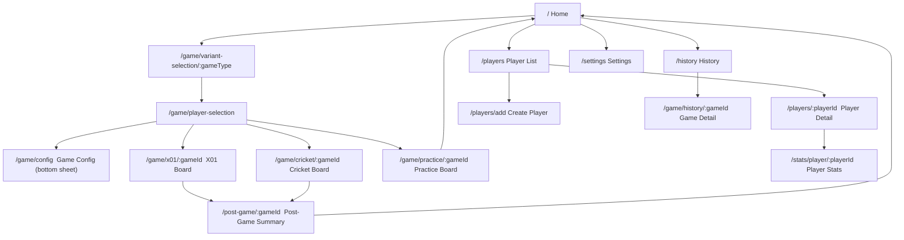

# UI Screen Flow Specifications

**Status:** Authoritative
**Version:** 4.0.0
**Companion specs:**
- `docs/design/SCREEN_SPECS.md` — detailed per-screen layout, typography, color, and notes
- `docs/design/DESIGN_SYSTEM.md` — design tokens (color, typography, spacing, radius)

All token names referenced in this document (e.g. `colorPrimary`, `textHeadingMedium`) are defined in `DESIGN_SYSTEM.md`. All per-screen detail lives in `SCREEN_SPECS.md`. This document covers navigation structure, screen index, and flow overview.

---

## Navigation Structure

The app uses a **hub-and-spoke** pattern.

- **Home** is the single hub. All other screens are spokes reachable from Home.
- There is **no persistent bottom navigation bar** anywhere in the app.
- **Settings** is accessed via a gear icon (⚙) in the Home AppBar only.
- Every sub-screen has only a back button in its AppBar — no other persistent nav chrome.
- **Game boards** (X01, Cricket, Practice) are full-screen with no AppBar navigation chrome.
- Sub-screen state does not need to be preserved between visits — reload-on-entry is acceptable.
- No `StatefulShellRoute` / persistent navigation stack is needed.

---

## Navigation Flow



---

## Screen Index

| # | Screen | Route |
|---|--------|-------|
| 1 | Home | `/` |
| 2 | Variant Selection | `/game/variant-selection/:gameType` |
| 3 | Player Selection | `/game/player-selection` |
| 4 | Game Config (bottom sheet) | `/game/config` |
| 5 | X01 Board | `/game/x01/:gameId` |
| 6 | Cricket Board | `/game/cricket/:gameId` |
| 7 | Practice Board | `/game/practice/:gameId` |
| 7a | — Around the Clock | (subtype of 7) |
| 7b | — Bob's 27 | (subtype of 7) |
| 7c | — Catch-40 | (subtype of 7) |
| 7d | — Shanghai | (subtype of 7) |
| 7e | — Checkout Practice | (subtype of 7) |
| 8 | Player List | `/players` |
| 9 | Player Detail | `/players/:playerId` |
| 10 | Create Player | `/players/add` |
| 12 | Stats Root *(deferred)* | `/stats` |
| 13 | Leaderboard *(deferred)* | `/stats/leaderboard` |
| 14 | Player Statistics | `/stats/player/:playerId` |
| 15 | Post-Game Summary | `/post-game/:gameId` |
| 16 | History | `/history` |
| 17 | Game Detail | `/game/history/:gameId` |
| 18 | Settings | `/settings` |

> Numbers 11 and the gap between 10 and 12 are intentionally absent — those slots are reserved for future screens.

---

## Per-Screen Summaries

For full layout details, typography, and color usage see `docs/design/SCREEN_SPECS.md`.

### 1. Home (`/`)

```
┌─────────────────────────────┐
│  Darts                   ⚙ │  ← gear → Settings
├─────────────────────────────┤
│   [X01]      [Cricket]      │  ← 2×2 square game cards
│   [Practice] [Statistics]   │
├─────────────────────────────┤
│  [History              →]   │  ← full-width nav card
│  [Players              →]   │  ← full-width nav card
├─────────────────────────────┤
│  (Coming soon, 0.6 opacity) │
│   [Game Lobby]              │
│   [VS Friends]              │
│   [Bluetooth]               │
└─────────────────────────────┘
```

- Gear icon (⚙) in AppBar is the **only** entry point to Settings; it is not a card.
- Coming-soon cards have no `onTap` handler and are visually de-emphasised (opacity 0.6).
- 2×2 game cards are square (`childAspectRatio: 1.0`), `radiusLarge` corners, minimum 120dp.

---

### 2. Variant Selection (`/game/variant-selection/:gameType`)

```
┌─────────────────────────────┐
│  AppBar: "[Game Type]"      │
├─────────────────────────────┤
│  [501 — Double Out]         │  ← tappable variant tiles
│  [301 — Double Out]         │    minimum 64dp height
│  [Standard Cricket]         │    single tap → Player Selection
│  …                          │
└─────────────────────────────┘
```

- A single tap pre-selects the variant and navigates directly to Player Selection — no confirm button.
- Selected tile: `colorPrimaryContainer` background, 3dp `colorPrimary` left border.

---

### 3. Player Selection (`/game/player-selection`)

```
┌─────────────────────────────┐
│  AppBar: "Players"          │
├─────────────────────────────┤
│  [501 · Double Out · Best of 3  ▾]  ← config chip, full-width, tappable
├─────────────────────────────┤
│  Selected players (drag to reorder) │
│  [Avatar] [Avatar] …        │
│   NAME     NAME             │
├─────────────────────────────┤
│  ┌─────────────────────┐    │
│  │ [Av][Av][Av][Av]    │    │  ← 4-col roster grid
│  │ NAME NAME NAME NAME │    │    ~2.33 rows visible (scroll cue)
│  │ [Av][Av][Av][ + ]   │    │
│  └─────────────────────┘    │
├─────────────────────────────┤
│  [START GAME]               │  ← full-width, SafeArea, 38% opacity when empty
└─────────────────────────────┘
```

- Config chip taps open the Game Config bottom sheet (Screen 4). The ⚙ icon is **not** present here.
- Roster "+" cell opens an inline modal: avatar preview + name field + CREATE PLAYER. New player auto-selected.
- Turn order matters — drag to reorder selected players.

---

### 4. Game Config (`/game/config`) — Bottom Sheet

```
┌─────────────────────────────┐
│  ──── drag handle           │
│  "Game Settings"            │
│                             │
│  Starting Score: [501▾]     │
│  In Strategy:   [Any ▾]     │
│  Out Strategy:  [Double▾]   │
│  Legs to Win:   [− 3 +]     │
│                             │
│  [APPLY SETTINGS]           │
└─────────────────────────────┘
```

- Rendered as a modal bottom sheet (`maxChildSize: 0.75`).
- Changes are local until APPLY SETTINGS is tapped. Drag-dismiss cancels without saving.

---

### 5. X01 Board (`/game/x01/:gameId`)

Full-screen, no AppBar nav chrome.

```
AppBar: "501" / "Leg 1 of 3"                          [⋮]
Dart indicator: [60] [T20] [○] [○]
──────────────────────────────────────────────
| [60]312 | 501    | …  |   ← N equal-width player columns
| ALICE ▶ | BOB    |    |     score + name + PPR
──────────────────────────────────────────────
💡 T20 · T18 · D8           ← checkout banner (≤170 only)
──────────────────────────────────────────────
Segment input grid:
  [ MISS ]  [ 25 ]  [ 50 ]           ← row 0 (miss / SB / DB)
  [ 20 ][ 19 ]…[ 12 ][ 11 ]         ← rows 1–2 (singles 20→1)
  [ 20 ][ 19 ]…[ 12 ][ 11 ]         ← rows 3–4 (doubles ·· )
  [ 20 ][ 19 ]…[ 12 ][ 11 ]         ← rows 5–6 (triples ···)
──────────────────────────────────────────────
[↩ Undo]                    [NEXT ROUND]
```

- Segment grid is grouped by **multiplier** (not by number): singles / doubles / triples, each spanning 2 rows of 10.
- Dots below numbers are purely visual: 2 filled dots = double, 3 filled dots = triple; no text label.
- Checkout banner collapses to zero height when not relevant.
- Active player column: `colorActivePlayerBg` background, 4dp `colorActivePlayer` left border.
- Singles: `colorSurface`; doubles: `colorPrimaryContainer`; triples: `colorPrimary` background.

---

### 6. Cricket Board (`/game/cricket/:gameId`)

Full-screen, no AppBar nav chrome. Unified table — scoreboard columns and input button columns share the same rows.

```
AppBar: "Cricket | Standard · Leg 1"                [⋮]
Dart indicator: [T20] [○] [○]
──────────────────────────────────────────────────────
| 64      | 32      | [MISS]  | [UNDO]  |  ← header row
| ALICE   | BOB     |         |         |
──────────────────────────────────────────────────────
| ⊗       | X       | [ 20 ] | [ 20 ] | [ 20 ] |
| /       | ⊗       | [ 19 ] | [ 19 ] | [ 19 ] |
| X       | X       | [ 18 ] | [ 18 ] | [ 18 ] |
| ─       | /       | [ 17 ] | [ 17 ] | [ 17 ] |
| ─       | ─       | [ 16 ] | [ 16 ] | [ 16 ] |
| ─       | ─       | [ 15 ] | [ 15 ] | [ 15 ] |
| ─       | ─       | [Bull] | [Bull] | (gap)  |  ← no triple for Bull
──────────────────────────────────────────────────────
|                              | [NEXT PLAYER]      |
```

Mark symbols: `─` (0 marks) → `/` (1) → `X` (2) → `⊗` (3+, `colorCricketClosed`).
Closed rows (all players ≥3 marks) are dimmed to 38% opacity; input buttons disabled.
Input button styling mirrors X01: single = `colorSurface`, double = `colorPrimaryContainer`, triple = `colorPrimary`.

---

### 7. Practice Board (`/game/practice/:gameId`)

Full-screen, no AppBar nav chrome. Five sub-types share a common chrome:

```
AppBar: "[Game Name]" / "[progress subtitle]"        [⋮]
Dart indicator: [60] [T20] [○] [○]
────────────────────────────────────────────────────
  DartboardHighlightWidget (Expanded)
  current target highlighted colorPrimary; others 35% opacity
────────────────────────────────────────────────────
  Target label (48sp Oswald, colorPrimary)
  Secondary metric (textBodyMedium, colorOnSurfaceVariant)
────────────────────────────────────────────────────
  Input buttons (varies per sub-type — see below)
────────────────────────────────────────────────────
  [↩ Undo]  [MISS]  [ACTION]
```

**7a. Around the Clock** — subtitle "Number: N / 20". Input: `[S-N] [D-N] [T-N]`. Action: `NEXT ROUND` (enabled when `dartsThrownInTurn == 3`). Ends when target advances past 20.

**7b. Bob's 27** — subtitle "Target: D{N}". Score starts at 27; can go negative. Input: `[S-N] [D-N] [T-N]` (S and T dimmed, still tappable). Action: `NEXT ROUND`. Ends early if score ≤ 0 after any round.

**7c. Catch-40** — subtitle "Round N / {total}". Target threshold ≥40 per round. Input: full X01-style segment grid (MISS + singles + doubles + triples). Action: `NEXT ROUND`.

**7d. Shanghai** — subtitle "Round N / {total}". Input: `[S-N] [D-N] [T-N]`. Shanghai bonus if all three hit in one turn. Action: `NEXT ROUND`.

**7e. Checkout Practice** — subtitle "{successes}/{attempts} checkouts". Input: full X01-style segment grid. Action: `END DRILL` (always enabled after 3 darts). No `MISS` button in bottom bar (use grid row 0). Turn advances automatically after 3 darts.

---

### 8. Player List (`/players`)

```
┌─────────────────────────────┐
│  AppBar: "Players"  [+]    │
├─────────────────────────────┤
│  [Avatar] ALICE             │
│           3-dart avg 54.3   │
│  [Avatar] BOB               │
│           3-dart avg 41.0   │
│  …                          │
└─────────────────────────────┘
```

- Minimum row height 64dp. Tap row → Player Detail.
- Empty state: icon + "No players yet. Tap + to add your first player."

---

### 9. Player Detail (`/players/:playerId`)

```
┌─────────────────────────────┐
│  AppBar: "ALICE"       [🗑] │
├─────────────────────────────┤
│  [Avatar 80dp]              │
│  [  ALICE  ] ← inline editable
│                             │
│  [Games: 42] [Win%: 62%]   │
│  [Darts: 1204]              │
├─────────────────────────────┤
│  [VIEW STATISTICS]          │
│  [VIEW GAME HISTORY]        │
└─────────────────────────────┘
```

- Name is an inline editable field — no separate ✏ icon. AppBar title syncs.
- Stat cards: Games Played, Win Rate, Darts Thrown (game-type-agnostic only).
- Delete (🗑) shows confirmation dialog with `colorError` destructive confirm.

---

### 10. Create Player (`/players/add`)

```
┌─────────────────────────────┐
│  AppBar: "New Player"       │
├─────────────────────────────┤
│  Avatar preview (60dp)      │
│  [      Name field      ]   │
│  [CREATE PLAYER]            │
└─────────────────────────────┘
```

- Button disabled until name is non-empty and unique. Max 24 chars; counter shown at 80% limit.
- Avatar initials update live as user types.

---

### 12. Stats Root (`/stats`) — Deferred

Not yet specified. May redirect to a player-selection screen or show a placeholder. To be defined when leaderboard is planned.

---

### 13. Leaderboard (`/stats/leaderboard`) — Deferred

Out of scope for the current iteration. Route is reserved.

---

### 14. Player Statistics (`/stats/player/:playerId`)

```
┌─────────────────────────────┐
│  AppBar: "ALICE — Stats" [←]│
├─────────────────────────────┤
│  [X01] [Cricket] [Practice] │  ← game-type tab bar
├─────────────────────────────┤
│  [Legs Played] [Legs Won] [Solo Games]  ← 3 summary cards
├─────────────────────────────┤
│  [All X01▾][501][301] …    │  ← variant chip selector (X01 tab only)
├─────────────────────────────┤
│  [Last 10] [Last 100] [All] │  ← time range segmented button
├─────────────────────────────┤
│  PPR trend (line chart)     │
│  [📊 Overlay: Checkout %]   │
├─────────────────────────────┤
│  Detail table               │
│  PPR | First9 PPR | CO% | … │
└─────────────────────────────┘
```

- Cricket, Practice, Others tabs show a "coming soon" placeholder.
- Reached via "VIEW STATISTICS" on Player Detail. Route was previously `/stats/career/:playerId`.

---

### 15. Post-Game Summary (`/post-game/:gameId`)

```
┌─────────────────────────────┐
│  AppBar: "Game Summary"     │  ← no back button
├─────────────────────────────┤
│  🏆 ALICE  WINNER            │  ← winner card (colorWinContainer bg)
│   Avg: 72.3  Darts: 43      │
│  BOB                        │  ← loser card (colorSurface)
│   Avg: 54.1  Darts: –       │
├─────────────────────────────┤
│  [PLAY AGAIN]  [DONE]       │
└─────────────────────────────┘
```

- No back button (`automaticallyImplyLeading: false`). Navigation is explicit via the two buttons.
- Winner card: animated checkmark entrance (300ms scale-in) on first appear.

---

### 16. History (`/history`)

```
┌─────────────────────────────┐
│  AppBar: "History"          │
├─────────────────────────────┤
│  [All▾] [Date range▾] [✕]  │  ← filter bar
├─────────────────────────────┤
│  X01 · 501                  │
│  ALICE won · 3 legs         │
│  Mar 8 · 43 darts           │
│  …                          │
└─────────────────────────────┘
```

- Reached from Home History card. Infinite scroll; `loadNextPage()` fires within 200px of bottom.
- Initial load: 3 shimmer skeleton cards. Empty state: icon + "No completed games yet."

---

### 17. Game Detail (`/game/history/:gameId`)

```
┌─────────────────────────────┐
│  AppBar: "X01 · 501"  [←]  │
├─────────────────────────────┤
│  ALICE won · 43 darts       │
│  Mar 8, 2026                │
├─────────────────────────────┤
│  Per-player stat cards      │
│  [Avg] [High checkout]      │
│  [Legs] [Darts thrown]      │
├─────────────────────────────┤
│  Leg breakdown table        │
│  Leg 1: ALICE 25 darts      │
│  Leg 2: BOB   31 darts      │
│  …                          │
└─────────────────────────────┘
```

---

### 18. Settings (`/settings`)

```
┌─────────────────────────────┐
│  AppBar: "Settings"         │
├─────────────────────────────┤
│  Theme                      │
│   [Dark Mode] toggle        │
│   [System default] option   │
│  About                      │
│   [Version]                 │
│   [Open Source Licenses]    │
└─────────────────────────────┘
```

- Accessed via ⚙ in Home AppBar only. Back returns to Home.
- "Open Source Licenses" → Flutter's built-in `LicensePage`.

---

## Cross-Screen Patterns

### Loading States

| Context | Pattern |
|---|---|
| Full page initial load | Centered `CircularProgressIndicator` in `colorPrimary` on `colorBackground` |
| List initial load | 3 shimmer skeleton cards in `colorSurfaceVariant`, `radiusMedium` |
| List pagination | Small `CircularProgressIndicator` centered below last item |
| Button async action | `SizedBox(20×20)` `CircularProgressIndicator(strokeWidth: 2)` replaces button text |

### Error States

| Context | Pattern |
|---|---|
| Full page error | Centered `error_outline` icon (48dp) + message + "Retry" `TextButton` in `colorPrimary` |
| Snackbar (transient) | `colorErrorContainer` background, `colorOnErrorContainer` text, auto-dismiss 4s |
| Validation error (inline) | Field border `colorError`; helper text below in `colorError`, `textBodySmall` |

### Empty States

All empty states:
- Centered layout
- Large icon (64dp) in `colorOnSurfaceVariant` at 60% opacity
- Primary message: `textBodyLarge`, `colorOnBackground`
- Secondary message / CTA: `textBodyMedium`, `colorOnSurfaceVariant`
- When a creation CTA exists: `FilledButton` in `colorPrimary`

### Dialogs

All confirmation dialogs:
- Title: `textHeadingSmall`
- Body: `textBodyMedium`
- Cancel: `TextButton`, `colorOnBackground`
- Confirm: `FilledButton`, `colorPrimary` for neutral actions; `colorError` filled for destructive actions
- Corner radius: `radiusMedium` (12dp)
- Minimum width: `min(screen_width − 48dp, 320dp)`
